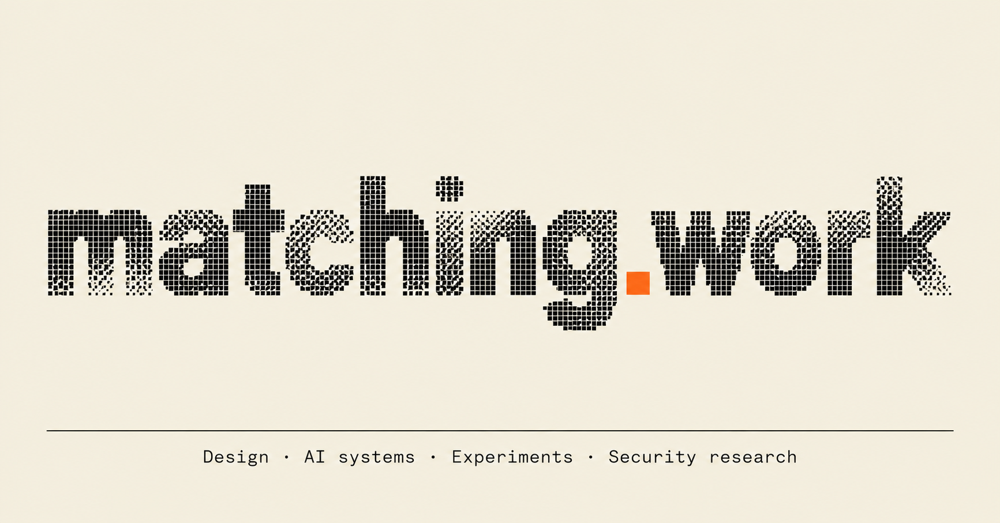

design, code, experiments. usually a few at once.

[matching.work](https://matching.work) · [research](https://matching.work/experiments) · [X](https://x.com/Back2Matching) · [email](mailto:matching@matching.work)

### Working on

**[Secori](https://secori.io/)**: an adaptive security harness for code and live apps. Bringing agent-led testing, finding reproduction and evidence into one workflow. In development.

### Tools & experiments

- [TurboQuant](https://github.com/back2matching/turboquant): KV cache compression for LLMs.
- [KV Cache Bench](https://github.com/back2matching/kvcache-bench): test compression methods on your own GPU.
- [matching.work](https://matching.work): interfaces, systems and other things I've built.

### Notes from the work

- [Who gets to be the first caller?](https://matching.work/experiments/first-opener-class-story)
- [MCP tools: read the schema too](https://matching.work/experiments/mcp-schema-excessive-agency)
- [What runs when you load a model?](https://matching.work/experiments/ml-model-file-supply-chain-scanners)
